# CLI - Task


### Install and Setup AWS cli on Local machine

Config PA credentials 
1. Install AWS cli in your local machine 

2. Create a IAM user and create access keys and secret keys 
 you need to pass in CLI command by using below command

  ```
  aws configure
  ```
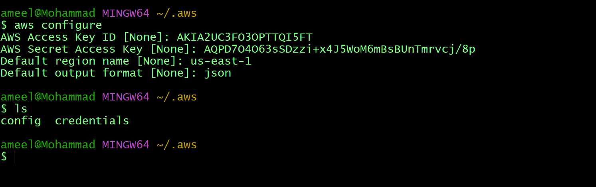

* Create VPC using cli
```
aws ec2 create-vpc --cidr-block 10.0.0.0/16

```
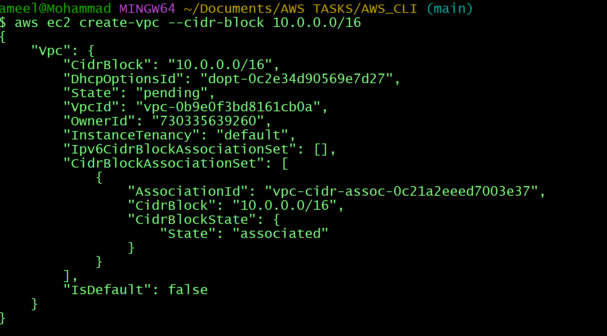

* create Pub and Pvt subnets
```
aws ec2 create-subnet --vpc-id vpc-0b9e0f3bd8161cb0a --cidr-block 10.0.1.0/24 --availability-zone us-east-1a
```
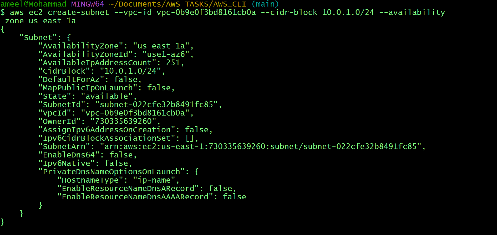
private subnet 

```
aws ec2 create-subnet --vpc-id vpc-0b9e0f3bd8161cb0a --cidr-block 10.0.2.0/24 --availability-zone us-east-1b

```
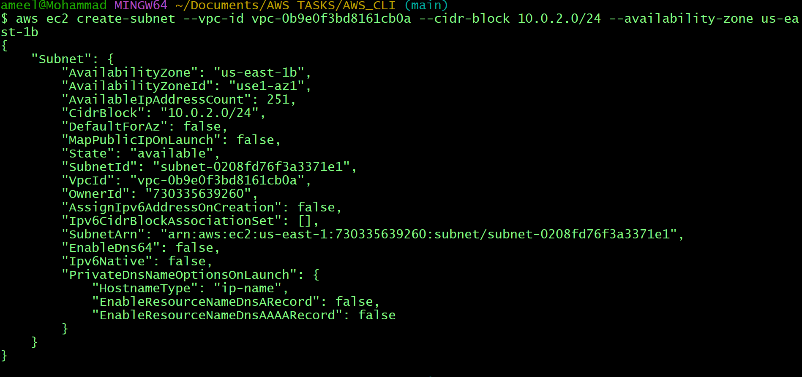
* create IGW
```
aws ec2 create-internet-gateway


```
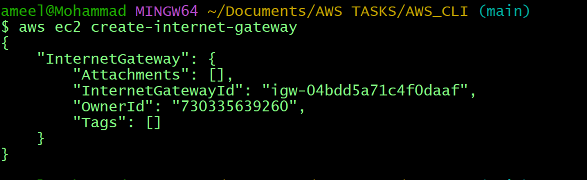
* Attach IGW to VPC

```
aws ec2 attach-internet-gateway --internet-gateway-id igw-04bdd5a71c4f0daaf --vpc-id vpc-0b9e0f3bd8161cb0a
```
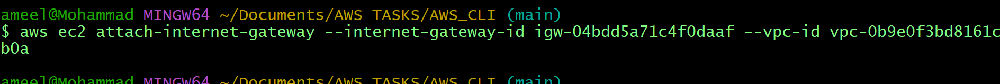
* Create Pub and PVT RT

```
aws ec2 create-route-table --vpc-id vpc-0b9e0f3bd8161cb0a

```
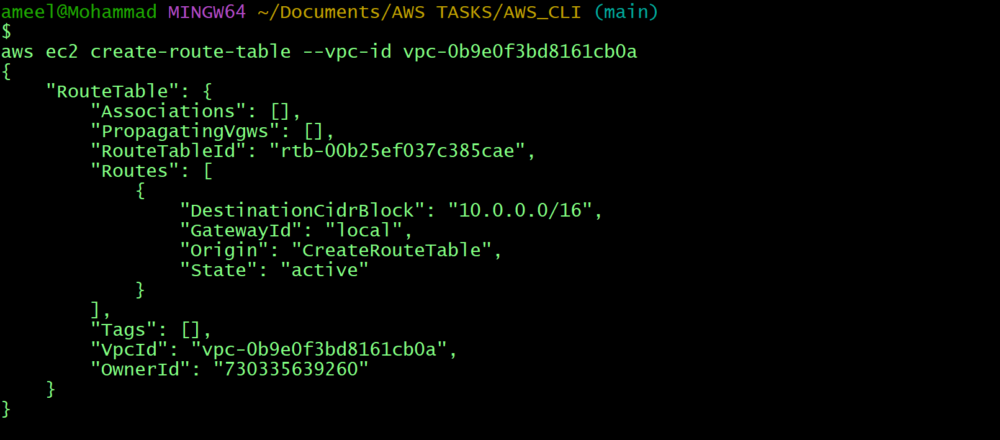
```
aws ec2 create-route-table --vpc-id vpc-0b9e0f3bd8161cb0a
```
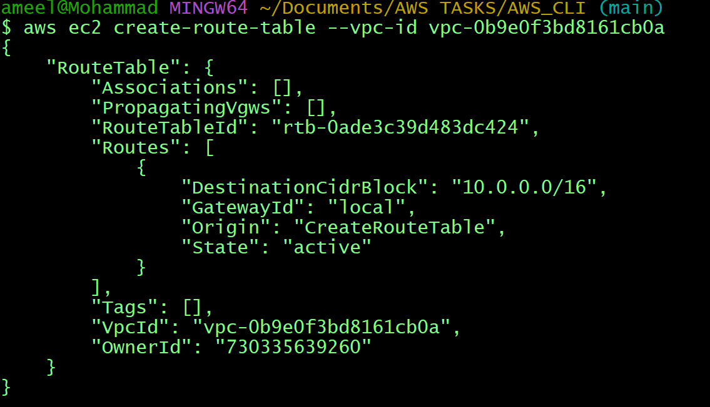

* Attach Pub sub to Pub rt
```
aws ec2 create-route --route-table-id rtb-00b25ef037c385cae --destination-cidr-block 0.0.0.0/0 --gateway-id igw-04bdd5a71c4f0daaf

```
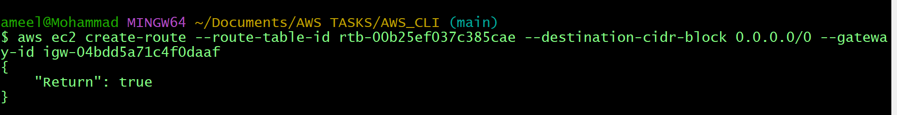

* Attach Pvt Sub to Pvt rt

```
aws ec2 create-route --route-table-id rtb-0ade3c39d483dc424 --destination-cidr-block 0.0.0.0/0 
```
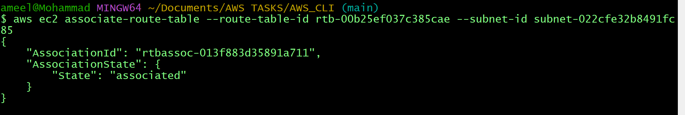
```
aws ec2 create-route --route-table-id rtb-00b25ef037c385cae --destination-cidr-block 0.0.0.0/0 --gateway-id igw-04bdd5a71c4f0daaf
```
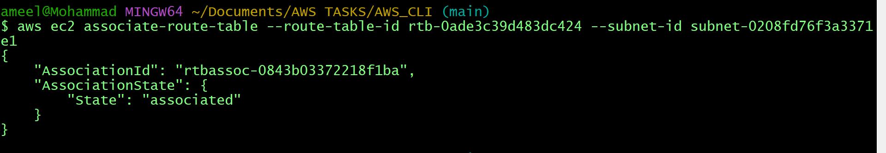
```
aws ec2 associate-route-table --route-table-id rtb-00b25ef037c385cae --subnet-id subnet-022cfe32b8491fc85

```
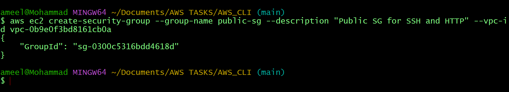
```
 aws ec2 associate-route-table --route-table-id rtb-0ade3c39d483dc424 --subnet-id subnet-0208fd76f3a3371e1

```
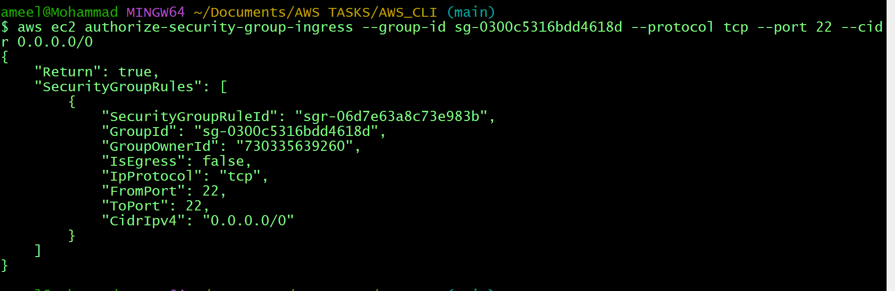
* Attach IGW to Pub RT


* Create Sg for ssh // http

```
aws ec2 create-security-group --group-name public-sg --description "Public SG for SSH and HTTP" --vpc-id vpc-0b9e0f3bd8161cb0a

```
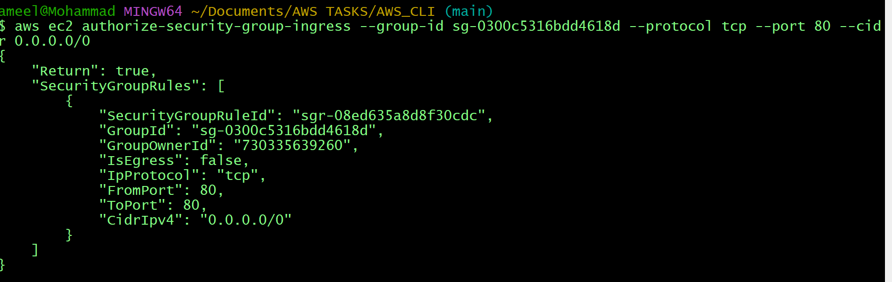
```
aws ec2 authorize-security-group-ingress --group-id sg-0300c5316bdd4618d --protocol tcp --port 22 --cidr 0.0.0.0/0
aws ec2 authorize-security-group-ingress --group-id sg-0300c5316bdd4618d --protocol tcp --port 80 --cidr 0.0.0.0/0

```

* Create a Ec2 in Pub Sub

```
aws ec2 run-instances --image-id ami-0166fe664262f664c --count 1 --instance-type t2.micro --key-name cli --security-group-ids sg-0300c5316bdd4618d --subnet-id subnet-022cfe32b8491fc85

```
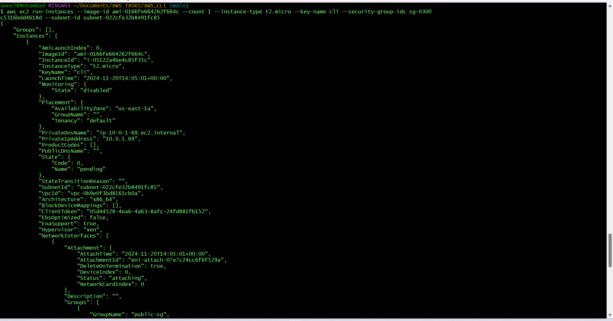
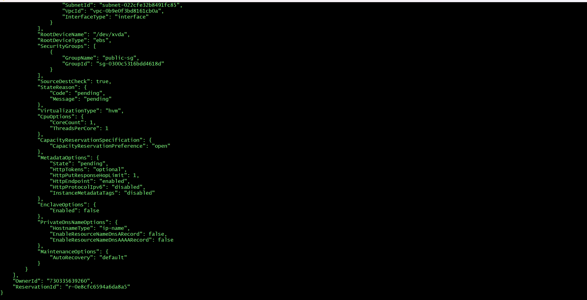
* Create a Ec2 in Pvt Sub 

```
aws ec2 run-instances --image-id ami-0166fe664262f664c --count 1 --instance-type t2.micro --key-name cli --security-group-ids sg-0300c5316bdd4618d  --subnet-id subnet-0208fd76f3a3371e1

```
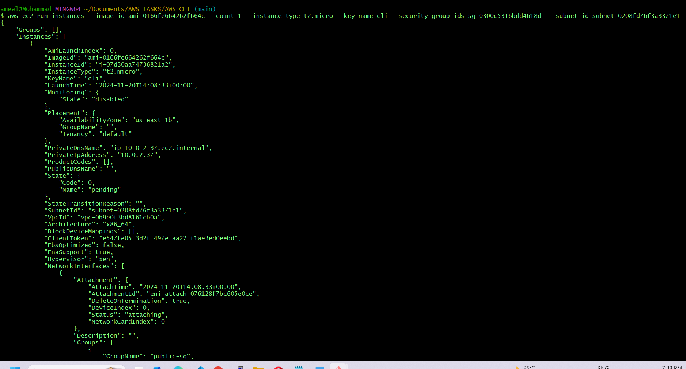
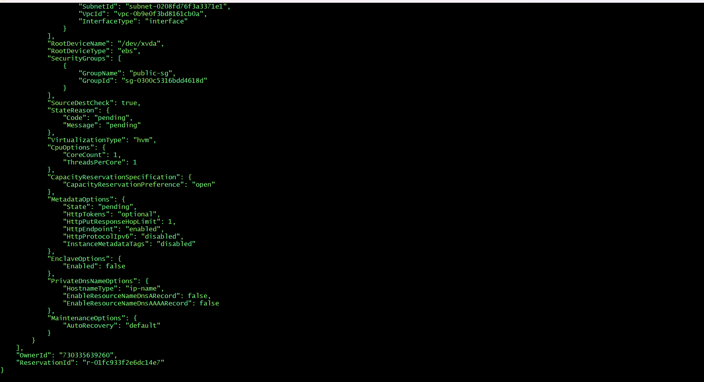

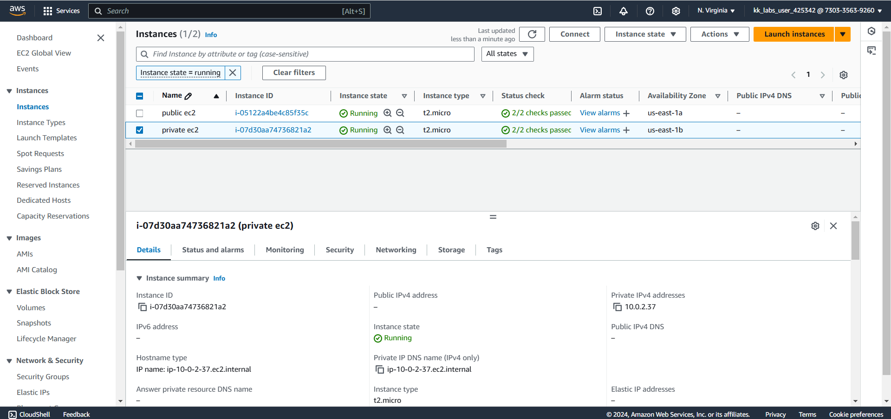
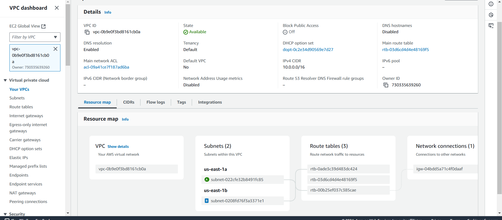

## AWS CLI TASK COMPLETED