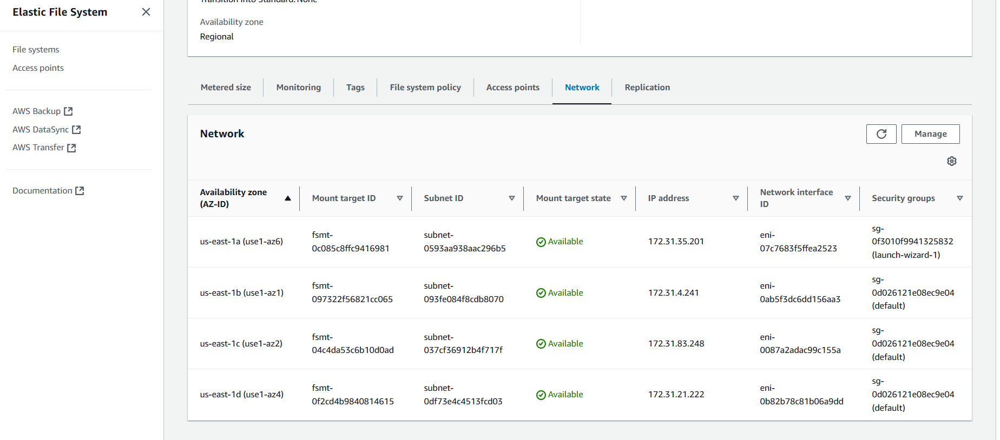
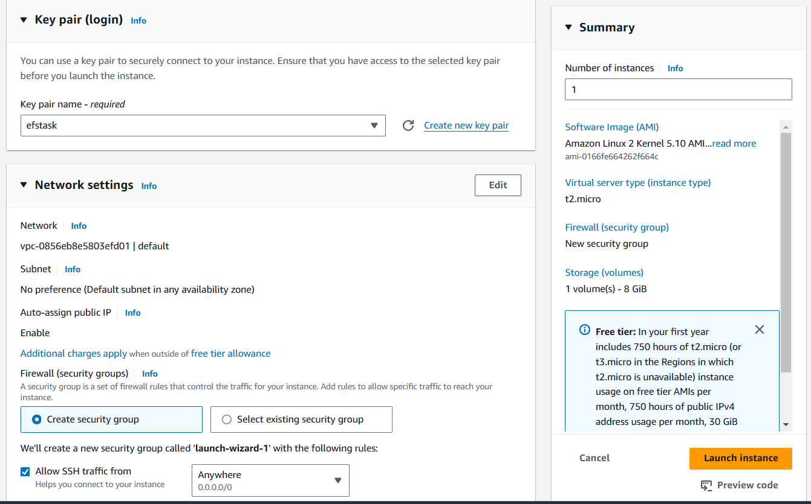
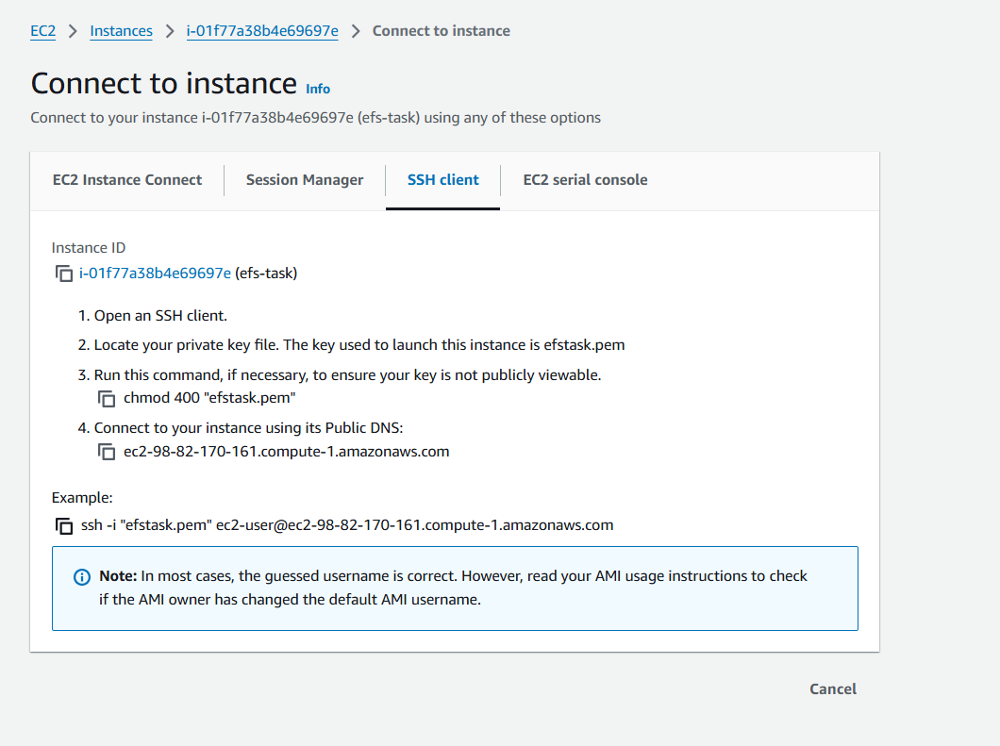

# Real-Time Chat Application Using AWS EC2 with EFS
### create a EFS 
### Step 1: Create an EFS File System

1. **Log in to the AWS Management Console** and navigate to the **EFS** service.

2. **Create a New File System:**
   - Click on "Create file system."
   - Choose the default settings, and make sure to create the file system in the same VPC where your EC2 instances will reside.
   - Note the **File System ID** for later use.
   - Click "Create file system."
   
   
   
### Step 2: Create and Launch EC2 Instances

1. **Navigate to the EC2 Dashboard** in the AWS Management Console.

2. **Launch EC2 Instances:**
   - Click on "Launch Instance."
   - Choose an Amazon Machine Image (AMI), such as **Amazon Linux 2**.
   - Select an instance type (e.g., `t2.micro` for the free tier).
   - Configure instance details, ensuring they are in the same VPC as your EFS.
   - **Add Storage:** Leave the default settings.
   - **Configure Security Group:**
     - Allow inbound traffic on port `22` (SSH) and port `3000` (for the chat application).

   - Review and launch the instance.




Step 3: Mount EFS on the EC2 Instances

1. **SSH into Your EC2 Instance:**
   ```bash
   ssh -i your-key.pem ec2-user@your-instance-public-dns
   ```

2. **Install the EFS Utilities:**
   ```bash
   sudo yum install -y amazon-efs-utils
   ```

3. **Create a Mount Point:**
   ```bash
   sudo mkdir /mnt/efs
   ```

4. **Mount the EFS File System:**
   - Replace `fs-XXXXXX` with your EFS File System ID.
   ```bash
   sudo mount -t efs fs-XXXXXX:/ /mnt/efs
   ```

5. **Ensure EFS is Mounted on Reboot:**
   - Edit the fstab file:
   ```bash
   echo "fs-XXXXXX:/ /mnt/efs efs defaults,_netdev 0 0" | sudo tee -a /etc/fstab
   ```


### Step 4: Set Up the Node.js Application
Optional: Managing Multiple Versions with nvm
If you need to manage multiple versions of Node.js:

1.Install nvm:
```
curl -o- https://raw.githubusercontent.com/nvm-sh/nvm/v0.39.5/install.sh | bash

```


2.Activate nvm: Add the following to your ~/.bashrc or ~/.bash_profile:


```
export NVM_DIR="$HOME/.nvm"
[ -s "$NVM_DIR/nvm.sh" ] && \. "$NVM_DIR/nvm.sh"

```
Reload the shell:
```
source ~/.bashrc

```
3. Install Node.js 16:

```
nvm install 16
nvm use 16

```
4.Verify the installation:

```
node -v
npm -v

```

. **Initialize a New Node.js Project:**
   ```bash
   npm init -y
   ```


4. **Install Required Packages:**
   ```bash
   npm install express ws body-parser
5. **Create the Server:**
   - Create a file named `server.js`:
     ```javascript
     const express = require('express');
     const WebSocket = require('ws');
     const bodyParser = require('body-parser');
     const fs = require('fs');
     const path = require('path');

     const app = express();
     const server = require('http').createServer(app);
     const wss = new WebSocket.Server({ server });

     const DATA_FILE = '/mnt/efs/messages.txt'; // EFS file path

     app.use(bodyParser.json());
     app.use(express.static('public'));

     app.get('/messages', (req, res) => {
         fs.readFile(DATA_FILE, 'utf8', (err, data) => {
             if (err) return res.status(500).send('Error reading messages');
             res.send(data);
         });
     });

     wss.on('connection', (ws) => {
         console.log('New client connected');

         ws.on('message', (message) => {
             console.log(`Received: ${message}`);
             fs.appendFile(DATA_FILE, message + '\n', (err) => {
                 if (err) console.error('Error saving message:', err);
             });

             // Broadcast the message to all connected clients
             wss.clients.forEach((client) => {
                 if (client.readyState === WebSocket.OPEN) {
                     client.send(message);
                 }
             });
         });

         ws.on('close', () => {
             console.log('Client disconnected');
         });
     });

     const PORT = process.env.PORT || 3000;
     server.listen(PORT, () => {
         console.log(`Server is running on port ${PORT}`);
     });
     ```
6. **Create a Simple HTML Client:**
   - Create a directory named `public`, and inside it create an `index.html` file:
     ```html
     <!DOCTYPE html>
     <html>
     <head>
         <title>Real-Time Chat</title>
         <style>
             body { font-family: Arial, sans-serif; }
             #messages { border: 1px solid #ccc; height: 300px; overflow-y: scroll; }
         </style>
     </head>
     <body>
         <h1>Chat Room</h1>
         <div id="messages"></div>
         <input type="text" id="message" placeholder="Type a message..." />
         <button id="send">Send</button>

         <script>
             const ws = new WebSocket('ws://' + window.location.host);
             const messagesDiv = document.getElementById('messages');
             const messageInput = document.getElementById('message');

             ws.onmessage = function(event) {
                 const message = document.createElement('div');
                 message.textContent = event.data;
                 messagesDiv.appendChild(message);
             };

             document.getElementById('send').onclick = function() {
                 const message = messageInput.value;
                 ws.send(message);
                 messageInput.value = '';
             };
         </script>
     </body>
     </html>
     ```
Step 5: Run Your Application

1. **Start the Server:**
   ```bash
   node server.js
   ```


**Access Your Application:**
   - Open a web browser and navigate to `http://your-instance-public-dns:3000`.
 
 